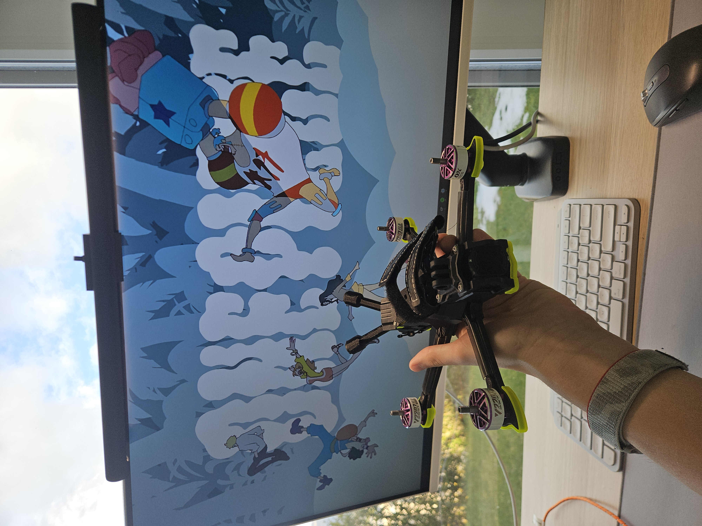

<table width="100%"><tr>
<td width="38%" align="center" valign="middle">


</td>
<td width="62%" valign="middle">

[](https://git.io/typing-svg)

<br />

I'm 17, studying electronics in Neuchâtel (CFC). I got into embedded systems because I wanted to build things that actually *do* something. Not just software on a screen.

I'm not a pro at all. I'm learning as I go, breaking stuff, reading datasheets I barely understand, slowly figuring it out. That's kind of the point.

Outside of electronics I build and fly FPV drones, run a lot, and love mountains :)

</td>
</tr></table>

<br />

## What I'm building right now

<table width="100%">
<tr>
<td width="58%" valign="top">

### Dice TFT Display

A circular GC9A01 display wired to a ring encoder — spin it, it rolls a dice face with a smooth transition animation.

Firmware written in **C++** on **PlatformIO**, running on an **ESP32-S3 wroom**.

```
Status  [ ██████░░░░░ ]  ~60% done
```                 

**What I learned doing this:**
- Design and receive my first ever PCB yay !!!
- Tft screen break easly... RIP
- Encoder debouncing in hardware + software

</td>
<td width="8%"></td>
<td width="34%" valign="middle" align="center">


<br/>
<sub><sup>ESP32-S3 · GC9A01 · Ring Encoder</sup></sub>

</td>
</tr>
</table>

<br />

---

<br />

## What I'm learning

These aren't skills I have — they're things I'm actively working on.

```
C / C++               ██████░░░░   getting comfortable
Embedded systems      █████░░░░░   active projects, still a lot to learn
SPI · I²C · UART      ████░░░░░░   used in projects, not fully solid yet
Electronics (CFC)     ██████░░░░   year 2/3
3D Printing           ████████░░   pretty confident
FPV building          █████████░   been doing it for over a year now
```

<br />

---

<br />

## Hardware I use

<details>
<summary><b>Microcontrollers</b></summary>
<br/>


</details>

<details>
<summary><b>Languages & Toolchain</b></summary>
<br/>


</details>

<details>
<summary><b>Protocols</b></summary>
<br/>


</details>

<details>
<summary><b>FPV</b></summary>
<br/>

5" self built · Air65 II 6S · DC5 v1.1 Frame · <a href="https://instagram.com/merlin.fpv">ig:@merlin.fpv</a>

</details>

<br />

---

<br />

## My builds

<div align="center">

<table>
<tr>
<td align="center" width="33%">
<br />
<sub><sup>DC5 v1.1 · freestyle/cinematic — 6S · 1950kv motors · DJI o4 Pro air unit</sup></sub>
</td>
<td align="center" width="33%">

<br />
<sub><sup>Smart Pumpkin · Candy dispenser </sup></sub>
</td>
<td align="center" width="33%">

<br />
<sub><sup>MatrixME · generative art</sup></sub>
</td>
</tr>
</table>

</div>

<br />

---

<br />

<div align="center">

`FPV` &nbsp;·&nbsp; `Mountains` &nbsp;·&nbsp; `Running`

<br />

<sub>If you want to support a student who spends his weekends soldering and crashing drones xD </sub>

<br />

<a href="https://buymeacoffee.com/merlin.rce">
  
</a>

<br /><br />

</div>


