

# Hey, I'm Merlin

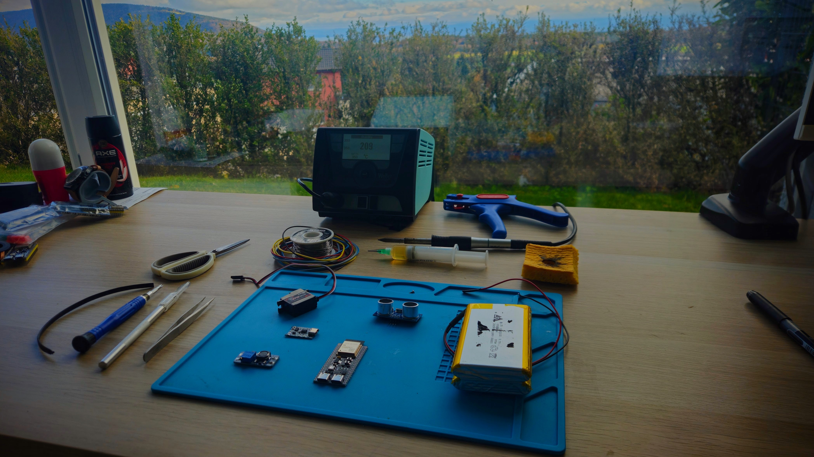

**Electronics Student · Maker · Future Engineer**

*From the French part of Switzerland*

 

---

## About Me

17-year-old Swiss student currently in my 2nd year of an **Electronics CFC**. I'm new to GitHub and programming, but I'm diving deep into the world of microcontrollers, circuits, and code. My goal? Become an engineer and build things that matter.

<table>
<tr>
<td width="50%">

### What I Do

- **Microcontrollers** — Mainly ESP32 projects
- **Languages** — C / C++ with PlatformIO
- **Current Focus** — OLED displays & menu systems
- **Learning** — I/O communication, sensors, and more

</td>
<td width="50%">

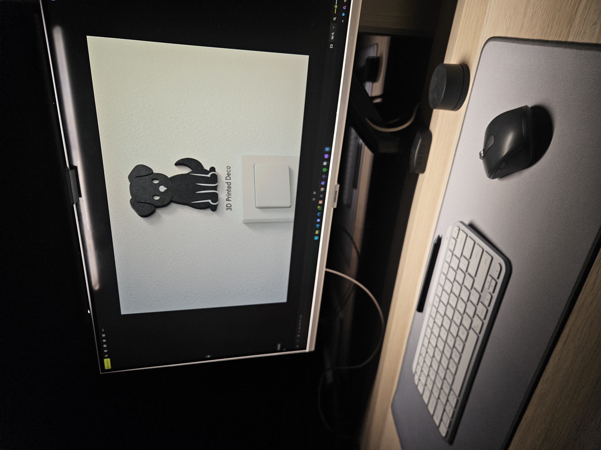

</td>
</tr>
</table>

---

## Current Projects

<table>
<tr>
<td align="center" width="33%">
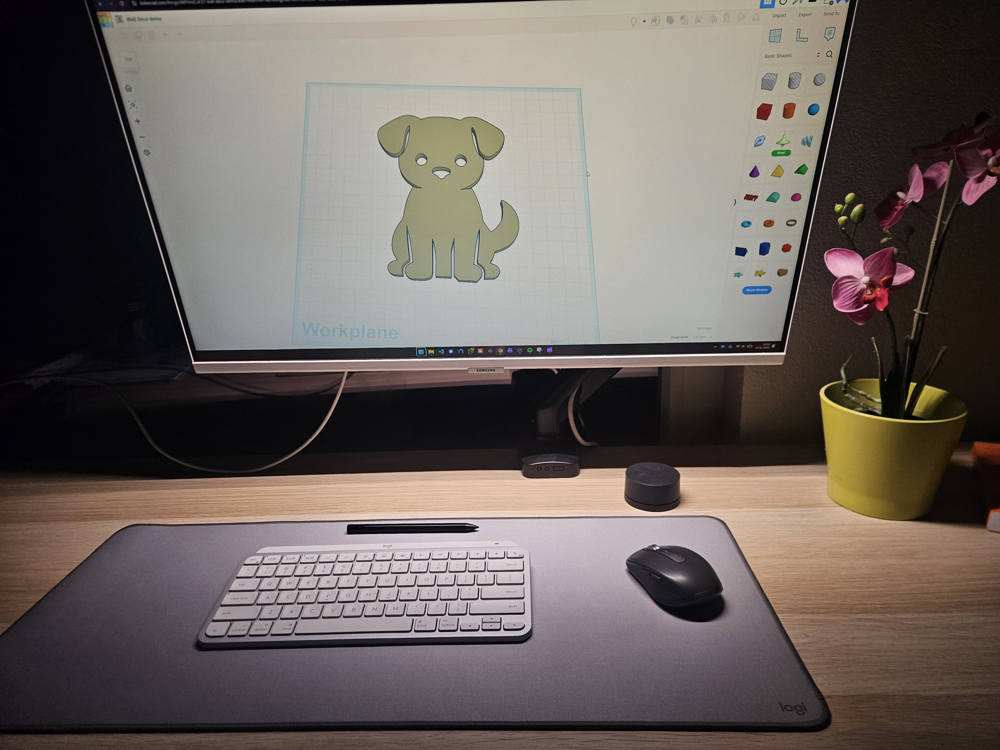
  
<b>ESP32 Experiments</b>
</td>
<td align="center" width="33%">
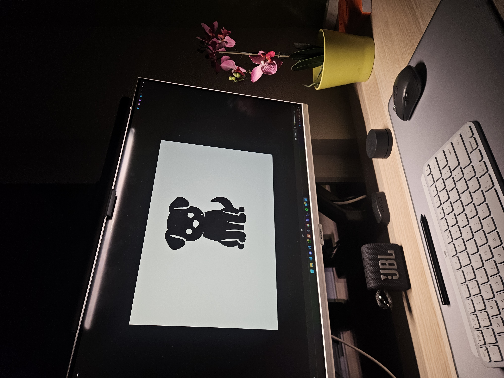
  
<b>OLED & Menu Systems</b>
</td>
<td align="center" width="33%">
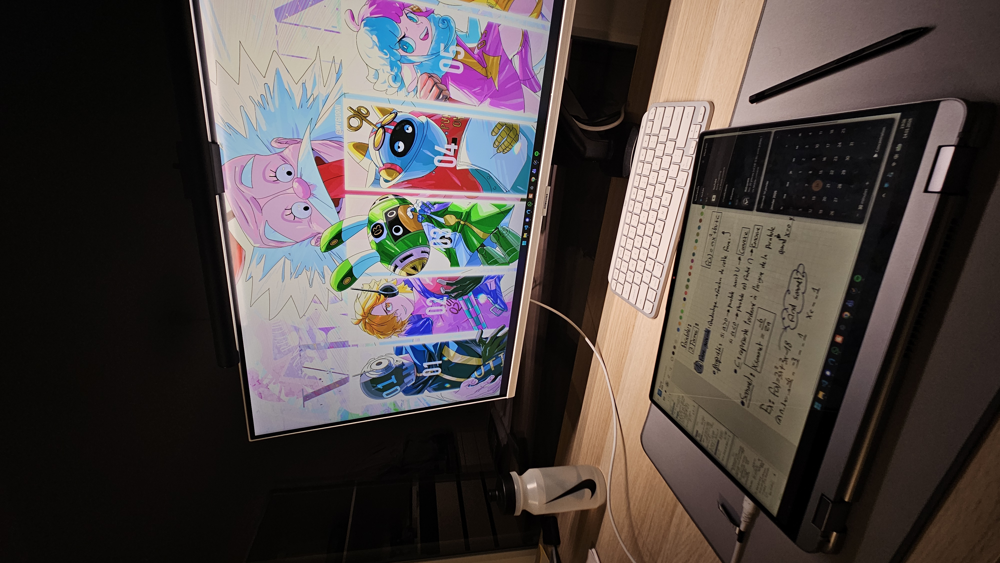
  
<b>Electronics Builds</b>
</td>
</tr>
</table>

---

## Tech Stack

---

## Workshop Vibes

<table>
<tr>
<td align="center" width="50%">
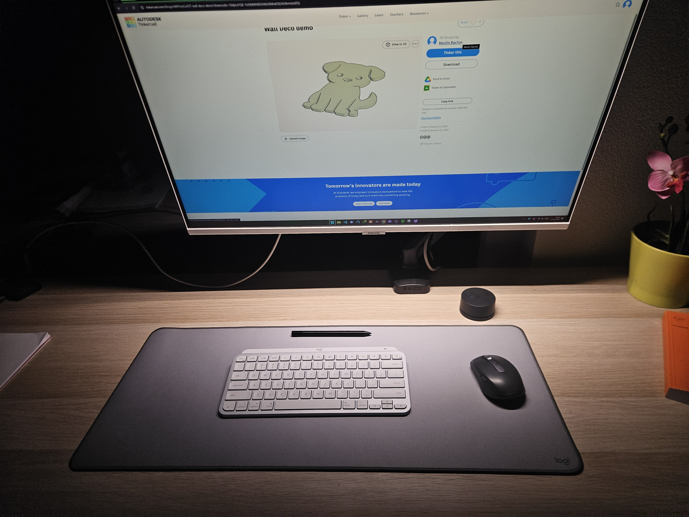
</td>
<td align="center" width="50%">
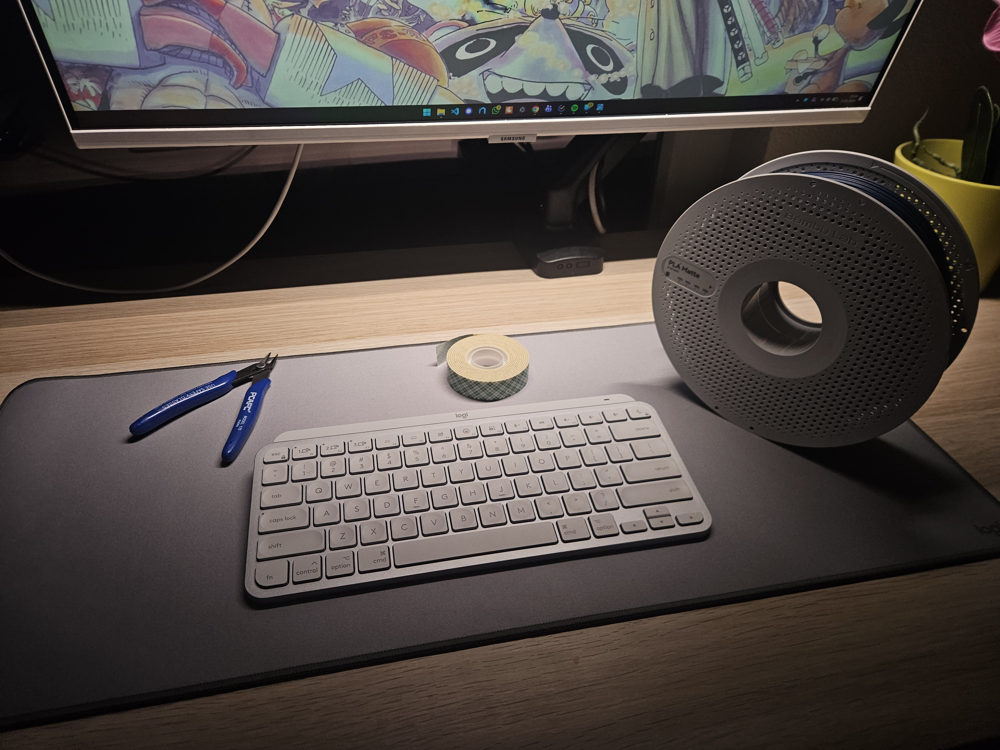
</td>
</tr>
<tr>
<td align="center" width="50%">
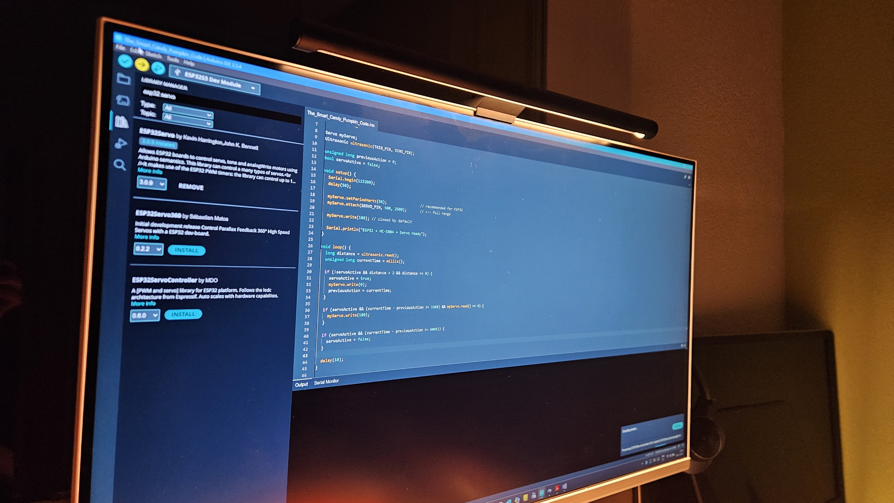
</td>
<td align="center" width="50%">
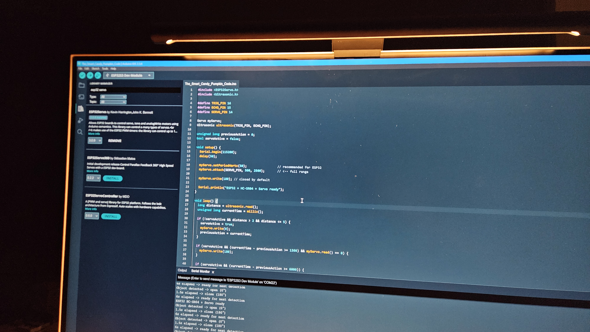
</td>
</tr>
</table>

---

## Beyond the Workbench

<table>
<tr>
<td width="60%">

When I'm not soldering or coding:

- Running 4x a week
- Snowboarding in the Alps
- Exploring nature with FPV drones
- Fan of innovation and inventors
- One Piece & Dr. Stone enthusiast

</td>
<td width="40%">

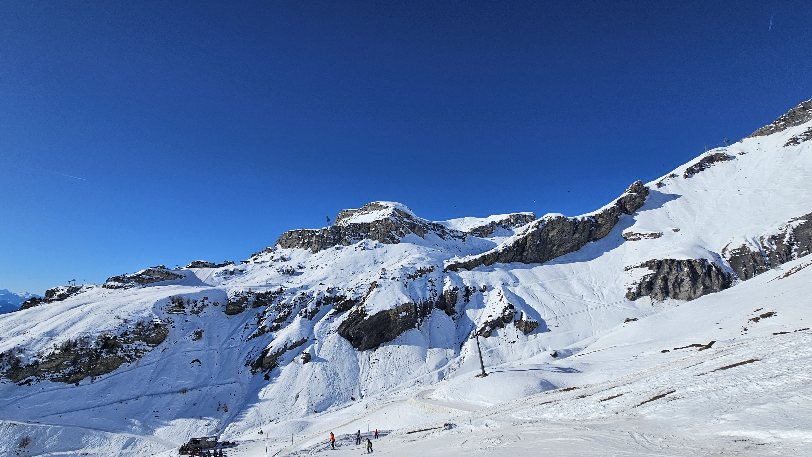

</td>
</tr>
</table>

<table>
<tr>
<td align="center" width="33%">

 <em>Alpine Adventures</em>
</td>
<td align="center" width="33%">
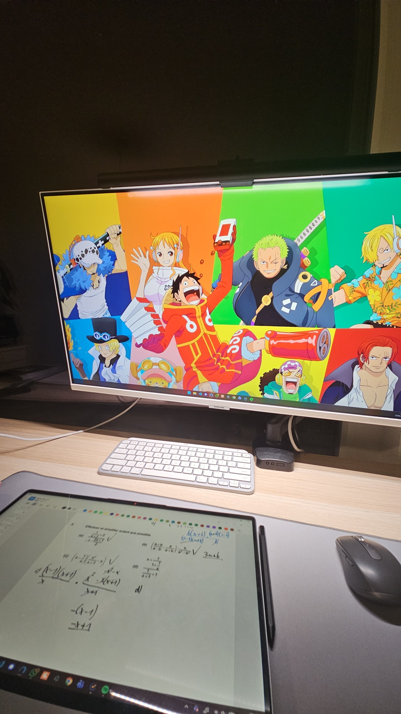
 <em>Swiss Nature</em>
</td>
<td align="center" width="33%">
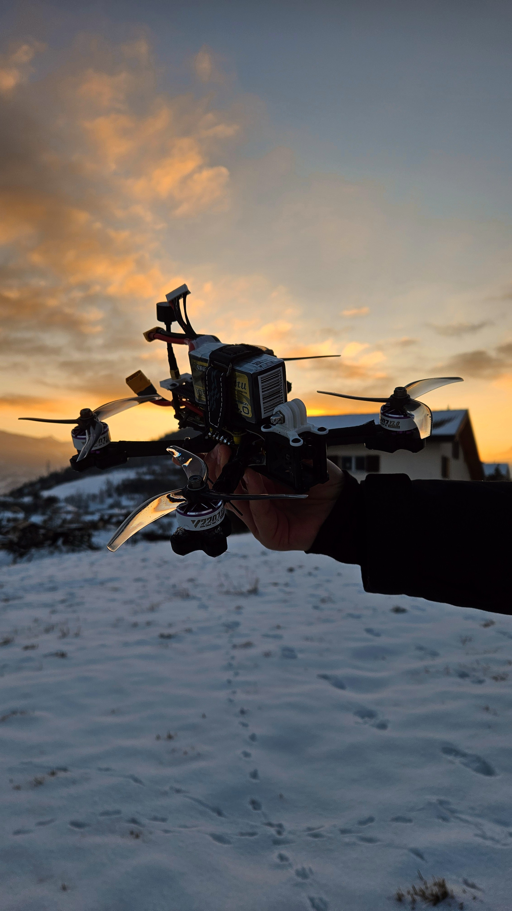
 <em>Winter Vibes</em>
</td>
</tr>
</table>

---

### Support My Projects

Swiss student who loves mixing electronics, coding, and creativity to bring ideas to life.  
Each project is a mix of fun, learning, and experimentation — your coffee keeps the magic going!

 

  

*"Get excited!"* — Senku Ishigami

 

